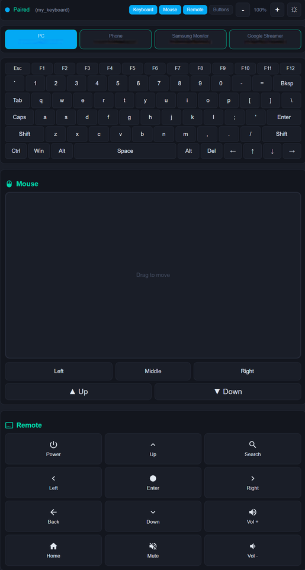
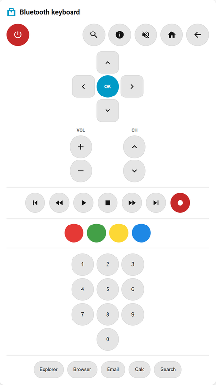

# ESP32 BLE HID Keyboard for ESPHome

This is a custom ESPHome component that transforms an ESP32 into a Bluetooth Low Energy (BLE) HID Keyboard. This component currently targets **ESP-IDF Bluedroid GATTS** (rather than NimBLE), chosen for the HID behavior and host compatibility validated in this project.

## Features

* **Standard HID Keyboard:** Recognized as a native keyboard by Windows, Android, and iOS. Full HOGP-compliant BLE HID with Device Information and Battery services. Use `passkey_mode: legacy` for Windows (Just Works for Android), `passkey_mode: secure_connections` for iOS.
* **Secure Pairing:** Supports a configurable 6-digit static passkey (PIN) for secure bonding on Windows and iOS. Android uses Just Works pairing (no PIN) due to HID compatibility limitations.
* **Efficient Memory Usage:** Direct API implementation ensures stability even with complex ESPHome configurations.
* **Key Combos:** Send any modifier + key combination using hex keycodes (e.g. Win+R, Ctrl+C).
* **String Typing:** Type any string directly. The active **keyboard layout** (`us`, `uk`, `de`) controls how each character is mapped to HID keycodes. UK adds `£`, `¬`, `€`; DE adds `ä`, `ö`, `ü`, `ß`, `€`, `§`, `°` via UTF-8.
* **Keyboard Layouts:** Choose `us` (default), `uk`, or `de` in YAML, or switch live from the web UI (persisted to NVS). Layout is fully extensible — see [Keyboard layouts](#keyboard-layouts).
* **Pre-defined Actions:** Built-in helpers for `ctrl_alt_del`, `sleep`, `hibernate` and `shutdown`.
* **Media Keys:** Control volume, playback, mute and more via HID consumer control.
* **Power Button:** Native HID power/sleep signals — no Run dialog, clean OS-level control.
* **Consumer Control:** Send any HID consumer code directly from YAML using `consumer:0xXXXX` syntax.
* **Mouse Control:** Left, right, and middle click, cursor movement, and scroll wheel via HID mouse reports.
* **Custom Text Input:** Send any text typed in Home Assistant directly to the paired host device.
* **RSSI Sensor:** Read the signal strength (dBm) of the connected host on a configurable interval. Supports proximity-based automations via `on_rssi_above` / `on_rssi_below`.
* **Keyboard LED Feedback:** Expose host-side Num Lock, Caps Lock, and Scroll Lock LED state as ESPHome binary sensors. Updated whenever the host writes a HID output report.

📖 [Keycode Reference](docs/keycodes.md) · [🌐 View Web Page](https://markusg1234.github.io/ESPHome-espidf_ble_keyboard)


## Usage Example

Add the following to your ESPHome YAML configuration:

```yaml
substitutions:
  device_name: bluetooth-keyboard
  friendly_name: "Bluetooth keyboard"
  wifi_ssid: "***"
  wifi_password: "***"
  api_encryption_key: "***"
  ota_password: "***"

esphome:
  name: ${device_name}
  friendly_name: ${friendly_name}

esp32:
  board: esp32dev   # Tested with esp32dev and esp32-c6-devkitm-1
  framework:
    type: esp-idf
    sdkconfig_options:
      CONFIG_BT_ENABLED: y
      CONFIG_BT_CONTROLLER_ENABLED: y
      CONFIG_BT_BLUEDROID_ENABLED: y
      CONFIG_BT_NIMBLE_ENABLED: n
      CONFIG_BT_BLE_ENABLED: y
      CONFIG_BT_GATTS_ENABLE: y
      CONFIG_BT_BLE_42_FEATURES_SUPPORTED: y
      CONFIG_BT_BLE_50_FEATURES_SUPPORTED: n
      CONFIG_BT_BLE_42_ADV_EN: y
      CONFIG_BT_BLE_42_SCAN_EN: y
      CONFIG_BT_BLE_SMP_ENABLE: y
      CONFIG_BT_ACL_CONNECTIONS: "4"

logger:

api:
  encryption:
    key: ${api_encryption_key}

ota:
  - platform: esphome
    password: ${ota_password}

wifi:
  ssid: ${wifi_ssid}
  password: ${wifi_password}
  power_save_mode: light
  fast_connect: true

external_components:
  - source:
      type: git
      url: https://github.com/markusg1234/ESPHome-espidf_ble_keyboard
      ref: main
      path: components
    components: [ espidf_ble_keyboard ]

espidf_ble_keyboard:
  id: my_keyboard
  # Optional: BLE device name shown during pairing (max 29 chars, default: "ESP32 BLE KB")
  device_name: "ESP32 BLE KB"
  # Optional: per-character delay when typing strings in ms (default: 80)
  key_delay_ms: 80
  # Optional: Set a 6-digit pairing code.
  # If omitted, the device will use "Just Works" (no PIN) pairing.
  # Note: Android does not support passkey pairing for BLE HID devices.
  passkey: 123456
  # Optional pairing mode when passkey is set:
  # legacy (default, Windows-friendly) or secure_connections (iOS-required)
  passkey_mode: legacy
  # Optional: enable built-in web control page at http://<device-ip>/ble_keyboard
  # Requires web_server component. No HA cards or services needed.
  web_control: true
  # Optional: number of host slots for multi-host switching (1–10, default: 4)
  host_slots: 4
  # Optional: web mouse sensitivity settings
  mouse_sensitivity: 1.0       # base movement speed (default: 1.0)
  mouse_acceleration: 0.15     # speed-based acceleration factor (default: 0.15)
  mouse_max_speed: 4.0         # max sensitivity cap (default: 4.0)
  scroll_sensitivity: 2.0      # scroll speed multiplier (default: 2.0)
  # Optional: screen geometry for absolute pointer (mouse_abs / mouse_abs_px / mouse_abs_mon)
  screen_width: 1920           # pixel space the host maps onto (default: 1920)
  screen_height: 1080          # for multi-monitor, set to the whole virtual desktop
  # Optional: monitor regions (virtual-desktop pixels) for mouse_abs_mon:<idx>:<x%>:<y%>
  # monitors:
  #   - { name: left,  x: 0,    y: 0, width: 1920, height: 1080 }
  #   - { name: right, x: 1920, y: 0, width: 1920, height: 1080 }
  # Optional: link text entities for custom text input (shows Send button in web UI)
  custom_text_id:
    - custom_text
  # Optional: per-slot passkey, pairing mode, and keyboard layout
  hosts:
    - slot: 0
      passkey: 111111
      passkey_mode: legacy
      layout: us           # auto-apply this layout whenever slot 0 becomes active
    - slot: 1
      passkey: 222222
      passkey_mode: legacy
      layout: uk           # ...and this one for slot 1
    - slot: 2
      passkey_mode: legacy
    - slot: 3
      passkey_mode: legacy

button:

  - platform: espidf_ble_keyboard
    keyboard_id: my_keyboard
    name: "Ctrl + F1"
    action: "combo:0x01:0x3A"

  - platform: espidf_ble_keyboard
    keyboard_id: my_keyboard
    name: "Win + R (Run Dialog)"
    # 0x08 = Windows Key, 0x15 = 'r'
    action: "combo:0x08:0x15"

  - platform: template
    name: "Template Hello"
    on_press:
      - lambda: |-
          id(my_keyboard).send_string("Hello\n");

  - platform: espidf_ble_keyboard
    keyboard_id: my_keyboard
    name: "Type Hello"
    action: "Hello\n"

  - platform: espidf_ble_keyboard
    keyboard_id: my_keyboard
    name: "Ctrl Alt Del"
    action: "ctrl_alt_del"

  - platform: espidf_ble_keyboard
    keyboard_id: my_keyboard
    name: "Sleep PC"
    action: "sleep"

  - platform: espidf_ble_keyboard
    keyboard_id: my_keyboard
    name: "Hibernate PC"
    action: "hibernate"

  - platform: espidf_ble_keyboard
    keyboard_id: my_keyboard
    name: "Shutdown PC"
    action: "shutdown"

  - platform: espidf_ble_keyboard
    keyboard_id: my_keyboard
    name: "Mute"
    action: "mute"

  - platform: espidf_ble_keyboard
    keyboard_id: my_keyboard
    name: "Volume Up"
    action: "volume_up"

  - platform: espidf_ble_keyboard
    keyboard_id: my_keyboard
    name: "Volume Down"
    action: "volume_down"

  - platform: espidf_ble_keyboard
    keyboard_id: my_keyboard
    name: "Play / Pause"
    action: "play_pause"

  - platform: espidf_ble_keyboard
    keyboard_id: my_keyboard
    name: "Open Calculator"
    action: "consumer:0x0192"

  - platform: espidf_ble_keyboard
    keyboard_id: my_keyboard
    name: "Left Click"
    action: "left_click"

  - platform: espidf_ble_keyboard
    keyboard_id: my_keyboard
    name: "Move Mouse Right"
    action: "mouse_move:50:0"

  - platform: espidf_ble_keyboard
    keyboard_id: my_keyboard
    name: "Scroll Down"
    action: "mouse_scroll:-3"

  - platform: espidf_ble_keyboard
    keyboard_id: my_keyboard
    name: "Cursor to Center"
    action: "mouse_abs:50:50"        # exact position, percent of screen

  - platform: espidf_ble_keyboard
    keyboard_id: my_keyboard
    name: "Click Corner & Return"
    action: "mouse_abs_save | mouse_abs:5:5 | left_click | mouse_abs_restore"

  - platform: espidf_ble_keyboard
    keyboard_id: my_keyboard
    name: "Send Custom Text"
    action: "send_custom_text"

  - platform: espidf_ble_keyboard
    keyboard_id: my_keyboard
    name: "Host 0"
    action:
      type: switch_host
      slot: 0

  - platform: espidf_ble_keyboard
    keyboard_id: my_keyboard
    name: "Host 1"
    action:
      type: switch_host
      slot: 1

  - platform: restart
    name: ${friendly_name}

text:
  - platform: template
    name: "Custom Text"
    id: custom_text
    mode: text
    optimistic: true

binary_sensor:
  - platform: espidf_ble_keyboard
    keyboard_id: my_keyboard
    name: "BLE Keyboard Paired"

  - platform: espidf_ble_keyboard
    keyboard_id: my_keyboard
    type: caps_lock
    name: "BLE Keyboard Caps Lock"

  - platform: status
    name: ${friendly_name}
```

## Configuration Variables

### `espidf_ble_keyboard`

* **id** (Required, ID): The ID used to link buttons or automations to this keyboard.
* **device_name** (Optional, string): The BLE device name advertised during pairing. Defaults to `ESP32 BLE KB`. Maximum 29 characters.
* **key_delay_ms** (Optional, int): Total delay per character when typing strings, in milliseconds. Split evenly between key-down and key-up. Defaults to `80`. Increase if characters are being dropped on slow BLE connections.
* **passkey** (Optional, int): A 6-digit static PIN (000000–999999). If set, the device uses static passkey pairing (legacy MITM bond) and requires this PIN during initial pairing.
* **passkey_mode** (Optional, string): Passkey security mode. `legacy` (default) uses legacy MITM bonding — tested and recommended for Windows. `secure_connections` uses LE Secure Connections MITM bonding — required for iOS passkey pairing (legacy mode does not work on iOS). Android does not support passkey pairing with BLE HID keyboards.
* **web_control** (Optional, bool): Enable a built-in web control page with keyboard and mouse UI at `http://<device-ip>/ble_keyboard`. Requires the `web_server` component. Defaults to `false`.
* **host_slots** (Optional, int): Number of host slots for multi-host switching (1–10). Each slot can store a bonded host. Switch between hosts using buttons, HA services, or the web control page. Defaults to `4`.
* **mouse_sensitivity** (Optional, float): Web mouse base movement multiplier. Defaults to `1.0`. Range: 0.1–10.0.
* **mouse_acceleration** (Optional, float): Web mouse speed-based acceleration factor. Defaults to `0.15`. Range: 0.0–2.0.
* **mouse_max_speed** (Optional, float): Web mouse maximum sensitivity cap. Defaults to `4.0`. Range: 0.5–20.0.
* **scroll_sensitivity** (Optional, float): Web mouse scroll speed multiplier. Defaults to `2.0`. Range: 0.1–10.0.
* **screen_width** / **screen_height** (Optional, int): The pixel space the host maps the absolute pointer's `0..32767` range onto, used by `mouse_abs_px` and `mouse_abs_mon`. For a single screen, set to its resolution; for a spanned multi-monitor setup, set to the whole **virtual desktop** size. Defaults to `1920` / `1080`. Range: 1–32767. See [Absolute mouse positioning](#absolute-mouse-positioning).
* **monitors** (Optional, list): Per-monitor regions (in virtual-desktop pixels) for `mouse_abs_mon:<idx>:<x%>:<y%>`. Each entry has optional `name` and required `x`, `y`, `width`, `height`. See [Absolute mouse positioning](#absolute-mouse-positioning).
* **custom_text_id** (Optional, ID or list of IDs): Link one or more ESPHome `text` entities for custom text input. Automatically registers a "Send" button in the web UI for each. Use `send_custom_text` or `send_custom_text:N` action to trigger.
* **keyboard_layout** (Optional, string): Default keyboard layout. One of `us` (default), `uk`. Controls how `send_string` maps each character to USB HID keycodes — must match the *host's* keyboard layout. Can be overridden at runtime from the web UI (persisted to NVS, survives reboot). See [Keyboard layouts](#keyboard-layouts) below.
* **hosts** (Optional, list): Per-slot passkey and pairing mode overrides. Each entry has:
  * **slot** (Required, int): Host slot number (0–9).
  * **passkey** (Optional, int): 6-digit PIN for this slot (000000–999999). If omitted, the slot uses the global `passkey` setting (or Just Works if no global passkey).
  * **passkey_mode** (Optional, string): `legacy` (default) or `secure_connections`. Overrides the global `passkey_mode` for this slot.

### `button` (Platform: `espidf_ble_keyboard`)

* **keyboard_id** (Required, ID): The ID of the `espidf_ble_keyboard` component.
* **action** (Required, string or mapping): The action to perform when the button is pressed. Accepts either a string or a dict with `type` key (see below).

### `binary_sensor` (Platform: `espidf_ble_keyboard`)

The binary_sensor platform supports four types via the `type` key:

#### Paired Sensor (default)

Reports whether the keyboard has completed BLE pairing with a host on the current connection.

* **keyboard_id** (Required, ID): The ID of the `espidf_ble_keyboard` component.
* **type** (Optional, string): `paired` (default).
* **name** (Optional, string): Friendly entity name shown in Home Assistant.

State behavior:

* **ON** = a `GAP: Pairing Successful` event occurred on the current connection.
* **OFF** = keyboard is disconnected (including host-side unpair) or not yet paired in this session.

#### LED State Sensors (Num Lock / Caps Lock / Scroll Lock)

Expose the host-side keyboard LED state, as reported by the connected host via the HID output report. Updates within one loop cycle of the host changing the lock state.

* **keyboard_id** (Required, ID): The ID of the `espidf_ble_keyboard` component.
* **type** (Required, string): One of `num_lock`, `caps_lock`, `scroll_lock`.
* **name** (Optional, string): Friendly entity name shown in Home Assistant.

State behavior:

* **ON** = the corresponding lock LED is currently lit on the host.
* **OFF** = the lock is off, or no host has sent an LED report yet.

```yaml
binary_sensor:
  - platform: espidf_ble_keyboard
    keyboard_id: my_keyboard
    type: num_lock
    name: "BLE Keyboard Num Lock"

  - platform: espidf_ble_keyboard
    keyboard_id: my_keyboard
    type: caps_lock
    name: "BLE Keyboard Caps Lock"

  - platform: espidf_ble_keyboard
    keyboard_id: my_keyboard
    type: scroll_lock
    name: "BLE Keyboard Scroll Lock"
```

Note: LED state reflects what the *host* thinks the lock state is. After re-pairing or host switching, sensors may briefly show stale values until the host sends a fresh LED report.

### `sensor` (Platform: `espidf_ble_keyboard`)

The sensor platform supports two types via the `type` key:

#### RSSI Sensor (default)

Exposes the RSSI (signal strength) of the currently connected host as an ESPHome sensor entity.

* **keyboard_id** (Required, ID): The ID of the `espidf_ble_keyboard` component.
* **type** (Optional, string): `rssi` (default).
* **name** (Optional, string): Friendly entity name shown in Home Assistant.
* **update_interval** (Optional, duration): How often to read RSSI from the connected host. Default: `10s`.

State behavior:

* Publishes the RSSI value in **dBm** (e.g. `-65`) while a host is connected.
* Publishes **unavailable** when the host disconnects.

```yaml
sensor:
  - platform: espidf_ble_keyboard
    keyboard_id: my_keyboard
    name: "BLE Host RSSI"
    update_interval: 15s
```

#### Active Host Sensor

Publishes the currently active host slot number (0-based). Updates instantly when the host is switched from the webserver, HA card, or YAML automation. Required for the keyboard card's host display to stay in sync.

* **keyboard_id** (Required, ID): The ID of the `espidf_ble_keyboard` component.
* **type** (Required, string): `active_host`.
* **name** (Optional, string): Friendly entity name shown in Home Assistant.

```yaml
sensor:
  - platform: espidf_ble_keyboard
    keyboard_id: my_keyboard
    type: active_host
    name: "BLE Keyboard Active Host"
```

The keyboard card auto-detects this entity by name pattern (`sensor.*_active_host`). If auto-detection fails, set `active_host_entity` in the card config:

```yaml
type: custom:ble-keyboard-card
device: bluetooth_keyboard
host_slots: 4
active_host_entity: sensor.bluetooth_keyboard_active_host
```

#### Proximity Automations

Use `on_rssi_above` and `on_rssi_below` on the main `espidf_ble_keyboard` component to trigger actions based on signal strength. Both fire on every RSSI sample that crosses the threshold — add your own debounce logic (e.g. a `script` or `globals` flag) if needed.

| Key | Description |
|---|---|
| `threshold` | RSSI value in dBm (−127 to 0). `on_rssi_above` fires when RSSI > threshold. `on_rssi_below` fires when RSSI < threshold. |

The automation receives a single `rssi` variable (int, dBm) you can use in lambdas.

```yaml
espidf_ble_keyboard:
  id: my_keyboard
  on_rssi_above:
    threshold: -65      # fires when host is close (strong signal)
    then:
      - logger.log:
          format: "Host nearby (RSSI %d dBm)"
          args: [rssi]
  on_rssi_below:
    threshold: -90      # fires when host moves far away (weak signal)
    then:
      - logger.log:
          format: "Host far away (RSSI %d dBm)"
          args: [rssi]
```

> **Tip:** Typical indoor RSSI values range from around −40 dBm (very close) to −90 dBm (far/weak). A threshold of −70 to −75 is a reasonable starting point for proximity detection.

#### Action Types

| Action | Description |
|---|---|
| `"Hello\n"` | Type a string. Use `\n` for Enter. Printable ASCII is supported on all layouts; non-ASCII (e.g. `£ ¬ €` on UK) is supported via UTF-8 when a layout exposes it. Characters with no layout mapping are silently skipped. |
| `"combo:0x08:0x15"` | Send a key combination. Format: `combo:<modifier_hex>:<keycode_hex>`. Use `0x00` as modifier for no modifier key. See [Keycode Reference](docs/keycodes.md). |
| `"combo:0x00:0x04"` | Send a plain keypress with no modifier. `0x04` = A, `0x05` = B ... `0x1D` = Z. |
| `"consumer:0x0192"` | Send any HID consumer control code. Format: `consumer:<usage_hex>`. See [Keycode Reference](docs/keycodes.md) for full list. |
| `"ctrl_alt_del"` | Send the Ctrl+Alt+Del secure login sequence. |
| `"sleep"` | HID System Sleep signal — clean OS-level sleep. |
| `"hibernate"` | Hibernate the PC — saves to disk, full power off. Requires `powercfg /hibernate on`. |
| `"shutdown"` | HID System Power Down signal — clean OS-level shutdown. |
| `"power"` | HID power button — triggers Windows power button action. |
| `"mute"` | Toggle mute. |
| `"volume_up"` | Volume up. |
| `"volume_down"` | Volume down. |
| `"play_pause"` | Play / pause media. |
| `"next_track"` | Skip to next track. |
| `"prev_track"` | Previous track. |
| `"stop"` | Stop media playback. |
| `"left_click"` | Mouse left click. |
| `"right_click"` | Mouse right click. |
| `"middle_click"` | Mouse middle click. |
| `"mouse_click:0x01"` | Mouse click with button mask. `0x01` = left, `0x02` = right, `0x04` = middle. Combine for simultaneous buttons. |
| `"mouse_move:<x>:<y>"` | Move mouse cursor. Values -127 to 127 (relative, pixels). |
| `"mouse_scroll:<wheel>"` | Scroll mouse wheel. Positive = up, negative = down (-127 to 127). |
| `"mouse_abs:<x%>:<y%>"` | Move cursor to an **exact** position, percent of screen (0–100, decimals allowed). E.g. `mouse_abs:50:50` = center. See [Absolute mouse positioning](#absolute-mouse-positioning). |
| `"mouse_abs_px:<x>:<y>"` | Move cursor to an exact position in **pixels** (uses `screen_width`/`screen_height`). |
| `"mouse_abs_mon:<idx>:<x%>:<y%>"` | Move cursor to a percent within declared `monitors[idx]` (multi-monitor). |
| `"mouse_abs_save"` | Remember the current absolute position (the one this device last set). |
| `"mouse_abs_restore"` | Jump back to the last `mouse_abs_save` position. |
| `"switch_host:N"` | Switch to host slot N (0–9). Reconnects to stored host or advertises for new pairing. |
| `"forget_host:N"` | Remove BLE bond for host slot N (0–9) and clear the slot. |
| `"string:hello"` | Explicit text typing — useful in multi-step macros to distinguish text from action names. |
| `"delay:N"` | Pause for N milliseconds (max 10000). Used between steps in multi-step macros. |
| `"send_custom_text"` | Send the first linked text entity's content. Requires `custom_text_id` in config. |
| `"send_custom_text:N"` | Send the Nth linked text entity (0-based). E.g. `send_custom_text:1` for the second. |

**Lambda helpers** (for use in YAML automations):

| Method | Description |
|--------|-------------|
| `execute_action("action_string")` | Run any action string from a lambda. Works with all action types above. Supports multi-step with `\|`. |
| `execute_macro(index)` | Run a web-defined macro by index (0-based, shown as [0], [1] in web UI). Returns `false` if index is out of range. |

---

## Dict Action Format

Instead of a string, `action` also accepts a mapping with a `type` key. This can be more readable for complex actions:

```yaml
# Combo — modifier + key
action:
  type: combo
  modifier: 0x01   # 0x00 = none, 0x01 = Ctrl, 0x02 = Shift, 0x04 = Alt, 0x08 = Win
  key: 0x04        # 0x04 = A ... 0x1D = Z, see Keycode Reference

# Plain keypress — no modifier
action:
  type: combo
  modifier: 0x00
  key: 0x04        # Just 'A'

# Consumer control
action:
  type: consumer
  code: 0x0192     # Open Calculator

# Mouse click
action:
  type: mouse_click
  buttons: 0x01    # 0x01 = left, 0x02 = right, 0x04 = middle

# Mouse move
action:
  type: mouse_move
  x: 50            # move 50px right
  y: -20           # move 20px up

# Mouse scroll
action:
  type: mouse_scroll
  wheel: 3         # scroll up 3 notches (negative = down)

# Absolute move — exact position, percent of screen
action:
  type: mouse_abs
  x: 50            # 50% across
  y: 50            # 50% down (center)

# Absolute move — exact pixels (uses screen_width / screen_height)
action:
  type: mouse_abs_px
  x: 1280
  y: 720

# Absolute move — percent within a declared monitor
action:
  type: mouse_abs_mon
  monitor: 1       # index into the `monitors:` list
  x: 50
  y: 50

# Switch host
action:
  type: switch_host
  slot: 1             # switch to host slot 1

# Forget host
action:
  type: forget_host
  slot: 2             # remove bond for host slot 2
```

Both formats are equivalent — the dict format is converted to the string format at compile time so there is no runtime difference.

---

## Multi-Host Switching

The keyboard supports up to 10 bonded hosts and can switch between them on the fly — like commercial keyboards with a host-switch button. Each host slot stores the bonded device address in NVS (persistent across reboots).

### How It Works

1. **Pair your first host** — it is automatically saved to slot 0.
2. **Switch to an empty slot** (e.g. slot 1) — the keyboard disconnects and starts advertising. Pair a new host; it is saved to that slot.
3. **Switch back** — the keyboard disconnects from the current host and uses directed advertising to reconnect to the stored host. The target host reconnects automatically (no re-pairing needed).

Each host slot uses a unique BLE address, so other bonded hosts won't interfere during pairing.

Switching takes 1–3 seconds depending on the host OS.

### YAML Configuration

```yaml
espidf_ble_keyboard:
  id: my_keyboard
  host_slots: 4          # 1–10, default: 4

button:
  - platform: espidf_ble_keyboard
    keyboard_id: my_keyboard
    name: "Host 0"
    action:
      type: switch_host
      slot: 0

  - platform: espidf_ble_keyboard
    keyboard_id: my_keyboard
    name: "Host 1"
    action:
      type: switch_host
      slot: 1

  - platform: espidf_ble_keyboard
    keyboard_id: my_keyboard
    name: "Host 2"
    action:
      type: switch_host
      slot: 2

  - platform: espidf_ble_keyboard
    keyboard_id: my_keyboard
    name: "Host 3"
    action:
      type: switch_host
      slot: 3

  - platform: espidf_ble_keyboard
    keyboard_id: my_keyboard
    name: "Forget Host 0"
    action:
      type: forget_host
      slot: 0
  - platform: espidf_ble_keyboard
    keyboard_id: my_keyboard
    name: "Forget Host 1"
    action:
      type: forget_host
      slot: 1
  - platform: espidf_ble_keyboard
    keyboard_id: my_keyboard
    name: "Forget Host 2"
    action:
      type: forget_host
      slot: 2
  - platform: espidf_ble_keyboard
    keyboard_id: my_keyboard
    name: "Forget Host 3"
    action:
      type: forget_host
      slot: 3            
```

String action format is also supported: `"switch_host:0"`, `"forget_host:2"`.

### Host Switching from Home Assistant

Add an ESPHome service to trigger host switching from HA automations:

```yaml
api:
  services:
    - service: switch_host
      variables:
        slot: int
      then:
        - lambda: |-
            id(my_keyboard).switch_host(slot);
    - service: forget_host
      variables:
        slot: int
      then:
        - lambda: |-
            id(my_keyboard).forget_host(slot);
```

### Web Control

When `web_control: true` is enabled, a full control page is available at `http://<device-ip>/ble_keyboard` with keyboard, mouse, and remote sections. Section toggle buttons in the toolbar let you show/hide each section. When `host_slots` > 1, a host bar appears below the toolbar showing all slots. Click a slot to switch. The active slot is highlighted. Occupied slots show the stored Bluetooth address.



### Action Reference

| Action | Description |
|---|---|
| `"switch_host:N"` | Switch to host slot N (0–9). If the slot has a stored host, uses directed advertising to reconnect. If empty, starts normal advertising for new pairing. |
| `"forget_host:N"` | Remove the bond for host slot N (0–9). Clears the stored address and removes the BLE bond from the ESP32. If the forgotten host is currently connected, it is disconnected. |

---

## Mouse Control Card for Home Assistant

A custom Lovelace card is included that provides a touchpad, 3 mouse buttons, and scroll controls. It requires ESPHome services to be defined so Home Assistant can call the mouse functions with parameters.

### 1. Add ESPHome services

Add the following to your ESPHome device YAML (alongside the existing `api:` section):

```yaml
api:
  encryption:
    key: ${api_encryption_key}
  services:
    - service: mouse_move
      variables:
        x: int
        y: int
      then:
        - lambda: |-
            id(my_keyboard).send_mouse_move(x, y);
    - service: mouse_scroll
      variables:
        amount: int
      then:
        - lambda: |-
            id(my_keyboard).send_mouse_scroll(amount);
    - service: mouse_click
      variables:
        btn: int
      then:
        - lambda: |-
            id(my_keyboard).send_mouse_click(btn);
    - service: mouse_abs            # move cursor to exact position, percent of screen
      variables:
        x: float
        y: float
      then:
        - lambda: |-
            id(my_keyboard).execute_action("mouse_abs:" + to_string(x) + ":" + to_string(y));
```

### 2. Install the card

1. Copy `docs/mouse-card.js` to your Home Assistant `config/www/` folder.
2. In Home Assistant: **Settings -> Dashboards -> Resources -> Add Resource**
   - URL: `/local/mouse-card.js`
   - Type: **JavaScript Module**

### 3. Add to a dashboard

```yaml
type: custom:ble-mouse-card
device: bluetooth_keyboard    # your ESPHome device name (underscored)
```

Example with all optional overrides:

```yaml
type: custom:ble-mouse-card
device: bluetooth_keyboard
name: Living Room Mouse       # card title (auto-detected from HA if omitted)
sensitivity: 2.0              # base cursor speed (default: 1.5)
mouse_acceleration: 0.2       # speed-based acceleration factor (default: 0.15)
mouse_max_speed: 6.0          # max sensitivity cap (default: 4.5)
scroll_sensitivity: 3         # faster scroll (default: 2)
tap_to_click: false           # disable tap-to-click (default: true)
```

Optional configuration:

| Option | Default | Description |
|---|---|---|
| `name` | Auto from HA | Card title. Auto-detected from HA device registry if omitted. |
| `sensitivity` | `1.5` | Base cursor speed multiplier. |
| `mouse_acceleration` | `0.15` | Speed-based acceleration factor. Higher = more acceleration on fast swipes. |
| `mouse_max_speed` | `4.5` | Maximum sensitivity cap. Limits how fast the cursor can move. |
| `scroll_sensitivity` | `2` | Scroll speed multiplier. |
| `tap_to_click` | `true` | Tap the touchpad for a left click (5px dead zone prevents accidental clicks). |

Features:
- **Touchpad** — 16:9 aspect ratio, drag to move cursor, tap for left click, mouse wheel/trackpad scroll.
- **Mouse acceleration** — slow movements are precise, fast swipes cover more ground.
- **Buttons** — Left, Middle, Right click.
- **Scroll** — Scroll Up / Scroll Down buttons (hold to repeat).
- **Auto device name** — card title is auto-detected from Home Assistant's device registry.


---

## Absolute Mouse Positioning

The touchpad / `mouse_move` actions are **relative** — they nudge the cursor by a
delta, like a real mouse. To move the cursor to an **exact** location, use the
absolute-pointer actions, which report a fixed coordinate that the host maps onto
the screen:

| Action | Coordinates |
|---|---|
| `mouse_abs:<x%>:<y%>` | Percent of the screen, `0`–`100` (decimals allowed). `mouse_abs:50:50` = center, `mouse_abs:0:0` = top-left, `mouse_abs:100:100` = bottom-right. **Resolution-independent — start here.** |
| `mouse_abs_px:<x>:<y>` | Exact pixels, converted using `screen_width` / `screen_height`. Set those to your host's resolution first. |
| `mouse_abs_mon:<idx>:<x%>:<y%>` | Percent within the region defined by `monitors[idx]` (see Multi-monitor below). |
| `mouse_abs_save` / `mouse_abs_restore` | Remember the current position and jump back later — e.g. `mouse_abs_save \| mouse_abs:5:5 \| left_click \| mouse_abs_restore`. |

Web/REST: `curl -X POST "http://<device-ip>/api/ble_keyboard/mouse_abs?x=50&y=50"`
(add `&unit=px` for pixels, `&monitor=1` for a monitor, `&btn=1` to click after moving).

### Save / restore — what it can and can't do

`mouse_abs_save` records the **last position the device itself commanded**, and
`mouse_abs_restore` jumps back to it. HID is a one-way input channel — the host
**never tells the device where the real cursor is** (the only host→device data is
the keyboard LED lock state). So restore is exact only when the ESP32 is the sole
thing moving the pointer; if you move a physical mouse in between, the device
still restores to *its* last value, not the true cursor. True capture of the OS
cursor would require a helper app on the host (`GetCursorPos`/`SetCursorPos`).

### Multi-monitor

Whether absolute coordinates can reach a second monitor is decided by the
**host**, not the firmware — the device cannot detect your monitor layout. The
host maps the `0..32767` range onto either the **primary monitor** or the **whole
virtual desktop**:

- On hosts that span the **virtual desktop**, set `screen_width` / `screen_height`
  to the total desktop size and (optionally) declare each monitor's region, then
  address a specific screen with `mouse_abs_mon`:

  ```yaml
  espidf_ble_keyboard:
    screen_width: 3840          # two 1080p monitors side by side
    screen_height: 1080
    monitors:
      - { name: left,  x: 0,    y: 0, width: 1920, height: 1080 }
      - { name: right, x: 1920, y: 0, width: 1920, height: 1080 }
  # mouse_abs_mon:1:50:50  -> center of the RIGHT monitor
  # mouse_abs:75:50        -> 75% across the whole desktop (also the right monitor)
  ```

- On hosts that confine the absolute pointer to the **primary monitor** (a common
  Windows default for a generic absolute mouse), only the primary monitor is
  reachable regardless of configuration. There is no firmware-side workaround.

### Host support

Absolute pointers are reliable on **Windows** and **Linux**. **macOS and iOS**
frequently ignore or mishandle absolute USB/BLE pointers — treat as best-effort.
The relative mouse (touchpad / `mouse_move`) is unaffected and keeps working on
all hosts.

---

## Web Control (Standalone — No Home Assistant)

A built-in web page with full keyboard and mouse control, served directly from the ESP32. Access it from any browser on the same network — no Home Assistant required.

### Setup

1. Add `web_server` and enable `web_control` in your YAML:

```yaml
web_server:
  port: 80

espidf_ble_keyboard:
  id: my_keyboard
  web_control: true
```

2. Flash and open `http://<device-ip>/ble_keyboard` in any browser or phone.

### Web Control Link in Home Assistant

Add this sensor to your YAML to get a clickable link in HA that opens the web control page:
 
```yaml
text_sensor:
  - platform: wifi_info
    ip_address:
      id: wifi_ip
      internal: true
  - platform: template
    name: "Web Control"
    icon: "mdi:keyboard"
    lambda: |-
      return {"http://" + id(wifi_ip).state + "/ble_keyboard"};
    update_interval: 60s
```

In Home Assistant, the sensor value will be a URL like `http://192.168.1.100/ble_keyboard`. Click it to open the web control page directly.

### Features

- **Full QWERTY keyboard** — letters, numbers, symbols, F-keys, modifiers, arrows
- **Mouse touchpad** — 16:9 aspect ratio, drag to move cursor, tap for left click (5px dead zone prevents accidental clicks)
- **Mouse acceleration** — slow movements are precise, fast swipes cover more ground (up to 4x)
- **Mouse buttons** — Left, Middle, Right click
- **Scroll controls** — buttons + mouse wheel on the touchpad
- **Remote control** — D-pad navigation (Up/Down/Left/Right/Enter), Power, Home, Back, Search, Volume +/-, Mute with hold-to-repeat
- **Section toggles** — show/hide Keyboard, Mouse, Remote, and Buttons sections individually (state saved in browser)
- **Zoom controls** — resize keyboard and mouse with +/- buttons (50%–150%)
- **Light/dark theme** — toggle between dark and light mode, preference saved in browser
- **BLE connection status** — live indicator shows Connected, Paired, or Disconnected (polls every 3s)
- **Device name display** — shows the configured `device_name` in the toolbar and browser tab title
- **Programmed buttons** — any buttons defined in YAML appear as clickable buttons on the web page
- **Zero dependencies** — no HA, no custom cards, no JS files to install
- **Works from any phone** — just open the URL in a mobile browser

### REST API

The web control page uses these local HTTP endpoints (useful for custom integrations):

| Endpoint | Method | Parameters | Description |
|---|---|---|---|
| `/api/ble_keyboard/string` | POST | `keys` (string) | Type text |
| `/api/ble_keyboard/key` | POST | `modifier` (int), `keycode` (int) | Send key combo |
| `/api/ble_keyboard/mouse_move` | POST | `x` (int), `y` (int) | Move cursor |
| `/api/ble_keyboard/mouse_click` | POST | `btn` (int) | Click button |
| `/api/ble_keyboard/mouse_scroll` | POST | `amount` (int) | Scroll wheel |
| `/api/ble_keyboard/mouse_abs` | POST | `x`, `y` (percent; `unit=px` for pixels; `monitor=<idx>`; optional `btn`) | Move cursor to an exact position |
| `/api/ble_keyboard/status` | GET | — | Returns `{"connected":bool,"paired":bool,"device_name":"..."}` |
| `/api/ble_keyboard/buttons` | GET | — | Returns JSON array of programmed buttons |
| `/api/ble_keyboard/press` | POST | `action` (string) | Trigger a programmed button action |
| `/api/ble_keyboard/hosts` | GET | — | Returns `{"active":N,"slots":[{"slot":N,"occupied":bool,"addr":"XX:XX:..."},...]}`  |
| `/api/ble_keyboard/switch_host` | POST | `slot` (int) | Switch to host slot 0–9 |
| `/api/ble_keyboard/forget_host` | POST | `slot` (int) | Remove bond for host slot 0–9 |
| `/api/ble_keyboard/macro_add` | POST | `name`, `action` | Add a new macro (max 16) |
| `/api/ble_keyboard/macro_update` | POST | `index`, `name`, `action` | Update an existing macro |
| `/api/ble_keyboard/macro_delete` | POST | `index` (int) | Delete a macro by index |

Example: `curl -X POST "http://<device-ip>/api/ble_keyboard/string?keys=Hello"`

---

## Keyboard Control Card for Home Assistant

A custom Lovelace card that provides a full on-screen QWERTY keyboard. It requires ESPHome services to be defined so Home Assistant can send keystrokes and text.

### 1. Add ESPHome services

Add the following services to your ESPHome device YAML (alongside any existing mouse services):

```yaml
api:
  encryption:
    key: ${api_encryption_key}
  services:
    - service: send_string
      variables:
        keys: string
      then:
        - lambda: |-
            id(my_keyboard).send_string(keys);
    - service: send_key
      variables:
        modifier: int
        keycode: int
      then:
        - lambda: |-
            id(my_keyboard).send_key_combo(modifier, keycode);
```

### 2. Install the card

1. Copy `docs/keyboard-card.js` to your Home Assistant `config/www/` folder.
2. In Home Assistant: **Settings -> Dashboards -> Resources -> Add Resource**
   - URL: `/local/keyboard-card.js`
   - Type: **JavaScript Module**

### 3. Add to a dashboard

```yaml
type: custom:ble-keyboard-card
device: bluetooth_keyboard    # your ESPHome device name (underscored)
```

Example with all optional overrides:

```yaml
type: custom:ble-keyboard-card
device: bluetooth_keyboard
name: Living Room Keyboard    # card title (auto-detected from HA if omitted)
show_fkeys: true             # hide F1-F12 row (default: true)
layout: us                    # us (default), uk, or de — match the ESP's keyboard_layout
host_slots: 4                 # show host switcher bar (default: 0 = hidden)
host_names:                   # custom names for each slot (optional)
  - TV
  - Phone
  - Laptop
  - Tablet
active_host_entity: sensor.bluetooth_keyboard_active_host  # (auto-detected)
```

Minimal UK layout example:

```yaml
type: custom:ble-keyboard-card
device: bluetooth_keyboard
layout: uk
```

Optional configuration:

| Option | Default | Description |
|---|---|---|
| `name` | Auto from HA | Card title. Auto-detected from HA device registry if omitted. |
| `show_fkeys` | `true` | Show the F1–F12 function key row. |
| `layout` | `us` | Keyboard layout for the on-screen card: `us`, `uk`, or `de`. UK draws the ISO shape (extra `\|` key, `£` on Shift+3); DE draws QWERTZ (Y/Z swapped, `ü`/`ö`/`ä`/`ß` keys, German modifier labels). Set this to match the ESP's `keyboard_layout` option so the visual matches what gets typed. |
| `host_slots` | `0` | Number of host slots. Set to match your `host_slots` config to show a host switcher bar with prev/next buttons, host name, and MAC address. `0` hides the bar. |
| `host_names` | `[]` | List of custom names for each host slot (e.g., `["TV", "Phone"]`). Index 0 = slot 0, etc. Falls back to switch_host button names from the ESP32, then "Host N". |
| `active_host_entity` | Auto | Entity ID of the active host sensor. Auto-detected by name pattern (`sensor.*_active_host`). Set explicitly if auto-detection fails. |

Features:
- **Full QWERTY layout** — letters, numbers, punctuation, all standard keys.
- **Modifier keys** — Ctrl, Alt, Win, Shift are sticky (toggle on, auto-release after next key).
- **Caps Lock** — persistent toggle with visual indicator.
- **Function keys** — F1–F12 (can be hidden with `show_fkeys: false`).
- **Arrow keys** — Up, Down, Left, Right + Delete.
- **Shift labels** — key labels update to show shifted characters when Shift is active.
- **Host switcher** — prev/next buttons to switch hosts, shows current host name and MAC address (requires `host_slots` and `switch_host` ESPHome service).
- **Auto device name** — card title is auto-detected from Home Assistant's device registry.
- **Keyboard layouts** — `layout: us` (default), `layout: uk`, or `layout: de` renders the matching ANSI/ISO/QWERTZ shape with the correct shifted labels.

> **Note:** Caps Lock state is tracked locally in the card. If Caps Lock is toggled from another keyboard, the card indicator may be out of sync.


---

## Media Remote Card for Home Assistant

A custom Lovelace card that provides a modern media remote control with power, navigation D-pad, volume, media playback, and app launch buttons.

### 1. Add ESPHome services

Add the following services to your ESPHome device YAML (alongside any existing keyboard/mouse services):

```yaml
api:
  encryption:
    key: ${api_encryption_key}
  services:
    - service: send_string
      variables:
        keys: string
      then:
        - lambda: |-
            id(my_keyboard).send_string(keys);
    - service: send_key
      variables:
        modifier: int
        keycode: int
      then:
        - lambda: |-
            id(my_keyboard).send_key_combo(modifier, keycode);
    - service: send_consumer
      variables:
        code: int
      then:
        - lambda: |-
            id(my_keyboard).send_consumer(code);
```

### 2. Install the card

1. Copy `docs/remote-card.js` to your Home Assistant `config/www/` folder.
2. In Home Assistant: **Settings -> Dashboards -> Resources -> Add Resource**
   - URL: `/local/remote-card.js`
   - Type: **JavaScript Module**

### 3. Add to a dashboard

```yaml
type: custom:ble-remote-card
device: bluetooth_keyboard    # your ESPHome device name (underscored)
```

Example with all optional overrides:

```yaml
type: custom:ble-remote-card
device: bluetooth_keyboard
name: Living Room Remote      # card title (auto-detected from HA if omitted)
show_numpad: true             # show number pad (default: false)
show_apps: true               # show app launch row (default: true)
show_color: true              # show color buttons (default: false)
```

Optional configuration:

| Option | Default | Description |
|---|---|---|
| `name` | Auto from HA | Card title. Auto-detected from HA device registry if omitted. |
| `show_numpad` | `false` | Show a number pad (0–9) for channel entry or PIN input. |
| `show_apps` | `true` | Show app launch buttons (Explorer, Browser, Email, Calc, Search). |
| `show_color` | `false` | Show red/green/yellow/blue color buttons (mapped to F1–F4). |

Features:
- **Power button** — HID power signal for clean OS-level power control.
- **D-pad navigation** — arrow keys + Enter, ideal for media apps and menus.
- **Back & Home** — Escape and Windows key for quick navigation.
- **Volume** — up, down, and mute with hold-to-repeat.
- **Channel** — Page Up/Down with hold-to-repeat for channel surfing.
- **Media playback** — play/pause, stop, previous, next, rewind, fast forward.
- **App launchers** — quick launch Explorer, Browser, Email, Calculator, Search.
- **Number pad** — optional 0–9 keypad for channel/PIN entry.
- **Color buttons** — optional red/green/yellow/blue (F1–F4).
- **Auto device name** — card title is auto-detected from Home Assistant's device registry.



---

## Web Macros

When `web_control: true` is enabled, macros can be created, edited, and deleted directly from the web UI at `/ble_keyboard` — no reflash needed. Macros are stored in NVS flash and persist across reboots. Up to 16 macros are supported.

The web UI provides:
- **Add form** with name, action textarea, and a preset dropdown (media, system, clipboard, consumer HID, text, delays)
- **Combo builder** — toggle Ctrl/Shift/Alt/Win modifier buttons, then pick a key (F1-F12, arrows, letters, numbers, etc.) to insert `combo:mod:key`
- **Edit/Delete** controls on each macro (pencil and X buttons)
- **Macro index** shown as `[0]`, `[1]`, etc. next to each macro name — use with `execute_macro(N)` in YAML
- YAML-defined buttons appear alongside macros but are not editable
- Selecting a preset or key appends to the action field with `|`, making it easy to build multi-step macros

### Multi-Step Macros

Macros support multiple commands separated by `|`. A 50ms delay is automatically inserted between steps. Use `delay:N` for explicit pauses (max 10000ms).

Examples:
| Action string | Description |
|---------------|-------------|
| `combo:2:6 \| delay:100 \| combo:2:25` | Copy, wait 100ms, Paste |
| `combo:2:4 \| delay:50 \| combo:2:6` | Select All, Copy |
| `play_pause \| delay:500 \| next_track` | Play/Pause, wait 500ms, Next Track |
| `combo:0:40 \| delay:200 \| combo:0:40` | Enter twice with 200ms gap |
| `combo:2:4 \| delay:50 \| string:hello` | Select All, type "hello" |
| `mouse_abs_save \| mouse_abs:90:10 \| left_click \| mouse_abs_restore` | Click top-right corner, then return the cursor |

Multi-step actions work everywhere: web macros, YAML buttons, `execute_action()`, and the `/api/ble_keyboard/press` endpoint.

### Triggering Macros from YAML

Use `execute_macro(index)` to run a macro by its index (0-based), or `execute_action("action_string")` to run any action string:

```yaml
binary_sensor:
  - platform: gpio
    pin: GPIO0
    name: "Macro Button"
    on_press:
      then:
        - lambda: |-
            id(my_keyboard).execute_macro(0);  // run first web macro
```

```yaml
button:
  - platform: template
    name: "Copy-Paste"
    on_press:
      then:
        - lambda: |-
            id(my_keyboard).execute_action("combo:2:6 | delay:100 | combo:2:25");
```

### Triggering Macros from Home Assistant

Web macros are created at runtime (stored in NVS), so they don't appear as individual Home Assistant entities — ESPHome entities are fixed at compile time. To reach them from HA, expose API services that call `execute_macro(index)` or `execute_action("...")`:

```yaml
api:
  services:
    # Run a stored web macro by its index ([0], [1], … shown in the web UI)
    - service: run_macro
      variables:
        index: int
      then:
        - lambda: |-
            id(my_keyboard).execute_macro(index);

    # Run any action string directly (single or multi-step with "|")
    - service: run_action
      variables:
        action: string
      then:
        - lambda: |-
            id(my_keyboard).execute_action(action);
```

Then call them from a HA automation, script, or **Developer Tools → Actions**:

```yaml
# Run web macro #0
action: esphome.<device_name>_run_macro
data:
  index: 0

# Or run an ad-hoc action string (no stored macro needed)
action: esphome.<device_name>_run_action
data:
  action: "mouse_abs_save | mouse_abs:0:0 | left_click | mouse_abs_restore"
```

> **Tip:** For a permanent, *named* clickable button in HA, define a `button:` platform entry instead (those auto-appear in HA and accept the same action strings, including multi-step). Web macros are best for ad-hoc, web-managed actions reached via `run_macro` / `run_action`.

### Macro REST API

| Method | Endpoint | Parameters | Description |
|--------|----------|------------|-------------|
| GET | `/api/ble_keyboard/buttons` | — | Returns all buttons and macros as JSON. Macros have `"editable":true` and `"index":N`. |
| POST | `/api/ble_keyboard/macro_add` | `name`, `action` | Add a new macro (max 16). |
| POST | `/api/ble_keyboard/macro_update` | `index`, `name`, `action` | Update an existing macro. |
| POST | `/api/ble_keyboard/macro_delete` | `index` | Delete a macro by index. |

---

## Custom Text Input

You can send arbitrary text from Home Assistant to the paired host device without hardcoding it in the YAML. Link text entities to the keyboard component with `custom_text_id`, then use the `send_custom_text` action:

```yaml
espidf_ble_keyboard:
  id: my_keyboard
  custom_text_id:
    - custom_text          # links the text entity below
    # - username_text      # add more text entities as needed

text:
  - platform: template
    name: "Custom Text"
    id: custom_text
    mode: text
    optimistic: true

button:
  - platform: espidf_ble_keyboard
    keyboard_id: my_keyboard
    name: "Send Custom Text"
    action: "send_custom_text"       # sends first text entity (index 0)
    # action: "send_custom_text:1"   # sends second text entity (index 1)
```

This adds a text input field and a send button to both Home Assistant and the web UI (via auto-registered buttons). A single ID also works: `custom_text_id: custom_text`.

You can also drive it from a Home Assistant automation — for example, updating the text entity from an `input_text` helper and then pressing the button:

```yaml
automation:
  - alias: "Send text via BLE keyboard"
    trigger:
      - platform: state
        entity_id: input_text.ble_keyboard_text
    action:
      - service: text.set_value
        target:
          entity_id: text.bluetooth_keyboard_custom_text
        data:
          value: "{{ states('input_text.ble_keyboard_text') }}"
      - service: button.press
        target:
          entity_id: button.bluetooth_keyboard_send_custom_text
```

> **Note:** Printable ASCII and Tab are supported on every layout. Non-ASCII characters work when they're part of the active layout's Unicode table (e.g. `£`, `¬`, `€` on `uk`). Unmapped characters and most control characters are silently skipped.

---

## Keyboard layouts

The component supports multiple keyboard layouts. The active layout affects how characters in `send_string` are translated into USB HID `(modifier, keycode)` pairs. It **must match the host PC's keyboard setting** — typing `@` from the ESP under `us` while the host is set to UK produces `"`, since the host reinterprets the same physical key under its own layout.

### Supported layouts

| ID | Name | Notes |
|---|---|---|
| `us` | English (US) | Default. ANSI shape. |
| `uk` | English (UK) | ISO shape. Adds `£`, `¬`, `€` via UTF-8 (AltGr for `€`). |
| `de` | German (QWERTZ) | ISO shape. Y/Z swapped. Adds `ä`, `ö`, `ü`, `ß`, `€`, `§`, `°`, `µ`, `²`, `³` via UTF-8. Dead keys (`^`, `` ` ``, `~`, `´`) auto-completed with a trailing space so they type as bare characters via `send_string`. |

#### German (DE) AltGr characters

A standard German keyboard prints these characters in the lower-right corner of certain keys. The on-screen keyboards (both the device's web UI and the HA Lovelace card) render the same hint labels. To type them: toggle **AltGr** (right Alt) on the on-screen keyboard, then click the key. `send_string` resolves all of them directly via UTF-8 — no AltGr toggle needed.

| Combo | Char | Combo | Char |
|---|---|---|---|
| AltGr+q | `@` | AltGr+8 | `[` |
| AltGr+e | `€` | AltGr+9 | `]` |
| AltGr+m | `µ` | AltGr+0 | `}` |
| AltGr+2 | `²` | AltGr+ß | `\` |
| AltGr+3 | `³` | AltGr++ | `~` |
| AltGr+7 | `{` | AltGr+< | `\|` |

### Setting the layout

**YAML (default at boot):**

```yaml
espidf_ble_keyboard:
  id: my_keyboard
  device_name: "ESP32 BLE KB"
  keyboard_layout: uk
```

**Web UI (overrides YAML, persisted to NVS):** open `http://<device-ip>/ble_keyboard` and use the layout dropdown in the Keyboard card header. The choice is saved and survives reboot. Erasing NVS reverts to the YAML default.

**Per host slot (YAML, auto-applied on switch):** add `layout:` to any entry in the `hosts:` list to bind a layout to that slot. When you switch to that host (via service, button, or web UI), the device flips to its layout automatically. This is ephemeral — it does not overwrite a manual web-UI pick in NVS, and switching to a slot with no `layout:` keeps whatever was active.

```yaml
espidf_ble_keyboard:
  id: my_keyboard
  host_slots: 4
  hosts:
    - slot: 0
      layout: us
    - slot: 1
      layout: uk
```

### Matching the host's layout

The device layout only sets how the ESP turns characters into HID codes — the host then re-interprets those codes under its own layout. If they don't agree you'll see wrong symbols (e.g. `#` arriving as `\` when the ESP is on `uk` but the host is on `us`).

- **Windows:** *Settings → Time & language → Language & region →* pick the language (e.g. *English (United Kingdom)*) *→ Options → Keyboards →* leave *United Kingdom*. Switch with `Win+Space`.
- **Android:** *Settings → System → Languages & input → Physical keyboard →* tap the BLE keyboard's name *→ Set up keyboard layouts →* enable *English (UK)*. Android defaults every BLE keyboard to US until you do this. (Samsung / OneUI path: *Settings → General management → Physical keyboard*.)
- **iOS / iPadOS:** *Settings → General → Keyboard → Hardware Keyboard →* tap the layout name *→* pick *British*.
- **Linux (Wayland / GNOME):** *Settings → Keyboard → Input Sources →* add *English (UK)*, then move it to the top, or use `setxkbmap gb` on X11. For German use *Deutsch* / `setxkbmap de`.

### Adding a new layout

The layout system is intentionally small. Adding a new layout (e.g. French AZERTY) touches just three places:

1. **`components/espidf_ble_keyboard/keyboard_layouts.cpp`** — add `HID_ASCII_MAP_XX[128]` + (optionally) `UNICODE_MAP_XX[]` and append one entry to the `LAYOUTS[]` registry array.
2. **`components/espidf_ble_keyboard/__init__.py`** — append `"xx"` to `SUPPORTED_LAYOUTS`.
3. **`components/espidf_ble_keyboard/web_control.cpp`** — append an `xx: { ROWS: [...] }` entry to the JS `LAYOUTS` object. If you also ship the HA keyboard card, mirror the entry into `docs/keyboard-card.js`.

No header changes, no `send_string` changes, no NVS code changes. The web UI dropdown, `/api/ble_keyboard/status` JSON, and YAML validation pick the new layout up automatically.

**Dead keys** (characters that wait for a follow-up on the host, e.g. `^`, `` ` ``, `~`, `´` on German): set the optional third field `followup_keycode` in `HidKeyMapping`/`UnicodeKeyMapping` to the HID scan code for space (`0x2C`). `send_string` will emit the dead key followed by space, which composes to the bare character on the host.

### Notes

- Characters with no mapping in the active layout are skipped silently (a debug log is emitted).
- A layout switch in the middle of a typing operation can't corrupt in-flight text — keystrokes are pre-resolved at enqueue time using whatever layout was active then.
- `combo:` actions (raw HID `(modifier, keycode)` pairs) are layout-independent by design. Macros built from `combo:` keep working unchanged after a layout change.
- The web "Keyboard" card visual reflects the active layout (US shows ANSI, UK shows ISO with the extra `\|` key and `£` on Shift+3, DE shows QWERTZ with `ü/ö/ä/ß` keys and German modifier labels).

---

## Pairing with Windows

When you first flash the device or change the `passkey`:

1. Open **Bluetooth & other devices** on Windows.
2. If your device name (default: "ESP32 BLE KB") is already listed, **Remove Device**.
3. Click **Add device** -> **Bluetooth**.
4. Select your device name (default: "ESP32 BLE KB").
5. Windows will prompt you to enter the PIN. Type your configured `passkey` (e.g., `123456`) and click **Connect**.

---

## Pairing with Android

Android does not support passkey pairing with BLE HID keyboards. For reliable pairing:

1. **Do not set a `passkey`** in `espidf_ble_keyboard` (omit the passkey option entirely).
2. Use `passkey_mode: legacy` (the default).
3. In Android Bluetooth settings, remove any previous entry for your device name (default: **ESP32 BLE KB**) before re-pairing.
4. Start pairing - it should connect instantly without prompting for a PIN.

Android uses Just Works pairing for BLE HID devices. Attempting to use passkeys will result in pairing failures or automatic fallback to Just Works.

---

## Pairing with iOS

For iOS using passkey pairing:

1. Set `passkey` and `passkey_mode: secure_connections` in `espidf_ble_keyboard`.
2. Remove any previous bond for your device name (default: **ESP32 BLE KB**) from iOS Bluetooth settings.
3. Reboot the ESP32 (or reflash), then pair again from iOS.
4. Enter the configured passkey when prompted.

For Just Works pairing (no passkey), use `passkey_mode: secure_connections` for best compatibility.

After pairing, you should see all CCC subscriptions in the log (keyboard, consumer, system) confirming iOS has fully enumerated the HID service.

Notes:

* `passkey_mode: secure_connections` is the tested and recommended mode for iOS.
* The component includes Device Information and Battery services required by iOS for HOGP (HID over GATT Profile) compliance.
* macOS is expected to work the same way but has not been explicitly tested.

---

## Known Working Pairing Notes

The current implementation has been validated on Windows, Android, and iOS.
Tested on Windows 11, Android 16, and iOS.
For first-time pairing, Android may require more than one attempt while it refreshes BLE cache and bond state.

Recommended pairing modes:

* **Fastest pairing (recommended for Android/Windows):** Omit `passkey` (Just Works) with `passkey_mode: legacy`. Pairs instantly on Android and Windows. For iOS, use `passkey_mode: secure_connections`.
* **Windows with passkey:** Set `passkey` with `passkey_mode: legacy`. Pairs quickly with PIN entry.
* **iOS with passkey:** Set `passkey` with `passkey_mode: secure_connections` (legacy mode does not work on iOS).

Recommended order:

1. Turn off Bluetooth on other nearby hosts (especially Windows) to avoid auto-connect races.
2. Remove old keyboard entries from the phone/PC.
3. Retry pairing from the target host.

After the first successful bond, reconnect behavior is typically stable.

---

## Troubleshooting

* **Not appearing in search:** Ensure no other device is currently connected. The ESP32 stops advertising once a connection is established.
* **PIN prompt not appearing:** Windows often caches old security profiles. Fully "Remove" the device from Windows Bluetooth settings and try again.
* **Windows needs multiple pairing attempts:** Remove old Bluetooth entries first, then retry pairing after the first failed attempt. The component now avoids duplicate advertising restarts and keeps existing bonds unless the auth failure is a known `0x51` mismatch.
* **Android says "can't connect":** Android often keeps stale BLE bonds. Remove the device from Bluetooth settings, reboot the ESP32, then pair again. If still failing, toggle phone Bluetooth off/on and retry.
* **Android pairing issues:** Android does not support passkey pairing with BLE HID keyboards. Ensure no `passkey` is configured in your YAML - use Just Works pairing with `passkey_mode: legacy`. Remove old bonds and try again.
* **Wrong symbols on Android (`#` shows as `\`, `"` shows as `@`, etc.):** Android defaults connected BLE keyboards to US layout. Change it under *Settings → System → Languages & input → Physical keyboard → [device name] → Set up keyboard layouts → English (UK)*. See [Matching the host's layout](#matching-the-hosts-layout).
* **iOS not pairing:** Set `passkey_mode: secure_connections`, remove old Bluetooth bonds on both devices, then pair again.
* **iOS pairs but no typing/control:** Ensure you are using `passkey_mode: secure_connections`. Remove the bond on both the iOS device and the ESP32 (reboot/reflash), then pair again. After pairing, check the log for `Consumer CCC=0x0001` and `System CCC=0x0001` — if these are missing, iOS has not fully subscribed to the HID reports. Reflash and re-pair from a clean state.
* **Typing speed / dropped characters:** The default `key_delay_ms: 80` (40ms key-down + 40ms key-up) suits most connections. If characters are dropped on a slow BLE connection, increase this value (e.g. `key_delay_ms: 120`). If typing feels too slow, it can be reduced.
* **Hibernate not working:** Hibernate uses the Windows Run dialog. Ensure the PC is not in a state where it is blocked (e.g., fullscreen app or UAC prompt). Also ensure hibernate is enabled: run `powercfg /hibernate on` in an admin command prompt.
* **PC not waking from sleep:** Check that **USB Wake Support** (or similar) is enabled in your BIOS/UEFI Power Management settings.
* **Re-pair after firmware update:** If the HID descriptor changes (e.g. after adding media keys), you must remove and re-pair the device in Windows Bluetooth settings.